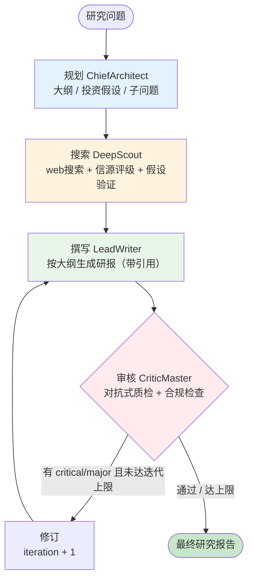

# FinAgent Research — 金融深度研究 Agent 系统

> 用多个专家 Agent 协作，对一个金融问题执行"规划 → 搜索 → 撰写 → 审核"的研究循环，
> 产出带数据、带引用、合规的研究报告。基于 LangGraph 状态机 + 对抗式审核。

---

## 项目简介

FinAgent Research 是 FinAgent 平台的**深度研究引擎**。和"快问快答"的 [finagent-core](../finagent-core) 互补——它处理需要多步搜索 + 综合分析的深度研究问题，几分钟产出一份券商研报式的报告。

它作为独立 HTTP 服务运行，被 finagent-core 通过 `research-proxy` 调用。用户在飞书里问"深度分析贵州茅台的投资价值"，就会触发本引擎。

---

## 架构：多 Agent 状态机 + 对抗审核循环



每个 Agent 通过共享的 `ResearchState`（全局工作记忆）通信，由 LangGraph 状态机驱动。

---

## 工程亮点

- **假设驱动研究**：架构师先提出可证伪的投资假设（如"茅台 PE 处于历史高位"），侦探带着假设去搜证，最后给出 支持/反驳/中立 的验证结论——比无目的搜索更高效、更严谨。
- **对抗式审核循环**：CriticMaster 是"毒舌评论家"，专挑无来源数据、逻辑漏洞、合规违规。审核不通过自动打回重写（最多 N 轮），直到合格。**实测能自动拦截并修正"买卖建议"等合规违规**。
- **信源可信度评级**：每条事实按来源打分（官方公告 0.95 / 券商研报 0.85 / 财经媒体 0.65 / 自媒体 0.35），撰写时优先采信高可信度来源。
- **SSE 流式输出**：研究过程实时推送进度（规划/搜索/撰写/审核），配合 finagent-core 实现飞书"正在研究…完成推送"的异步体验。
- **LangGraph 状态机编排**：4 个专家 Agent 用状态图自动编排，条件路由实现修订循环。
- **全链路可观测性**：节点级 LLM 调用通过 callback 埋点，与 finagent-core 共用统一监控。

---

## 核心 Agent

| Agent | 角色 | 产出 |
|---|---|---|
| ChiefArchitect | 总架构师 | 大纲、投资假设、待研究子问题 |
| DeepScout | 深度侦探 | 带可信度的事实库 + 假设验证结论 |
| LeadWriter | 首席撰稿人 | 按研报结构撰写、引用来源 |
| CriticMaster | 毒舌评论家 | 对抗式质检、合规审核、质量分 |

---

## 技术栈

| 层 | 技术 |
|---|---|
| Agent 编排 | LangGraph StateGraph + 条件路由 |
| 大模型 | DeepSeek |
| 网络搜索 | 博查AI / Tavily（可配置） |
| 服务 | FastAPI + SSE |
| 存储 | Redis（检查点）/ MongoDB（追踪） |

---

## 快速开始

```bash
python3 -m venv venv && source venv/bin/activate
pip install -r requirements.txt
cp .env.example .env        # 填 DEEPSEEK_API_KEY + 搜索 API key

# 启动服务（端口 8001）
bash dev.sh serve

# 测试（另一终端）
python test_api.py
```

API：`POST /research/stream`（SSE 流式返回进度 + 最终报告）

---

## 项目结构

```
src/deep_research/
├── state.py          # ResearchState 全局工作记忆 + 状态机
├── graph.py          # LangGraph 编排（规划→搜索→撰写→审核→修订循环）
├── agents/           # 4 个专家 Agent（base/architect/scout/writer/critic）
├── tools/            # web_search（博查AI/Tavily）
├── api/server.py     # FastAPI /research/stream
└── observability/    # 可观测性埋点
```

---

## 设计参考

借鉴公开的多 Agent 深度研究架构范式（LangGraph 状态机 + 假设驱动 + 对抗审核），针对金融场景独立实现。所有 AI 输出仅供研究参考，不构成投资建议。
